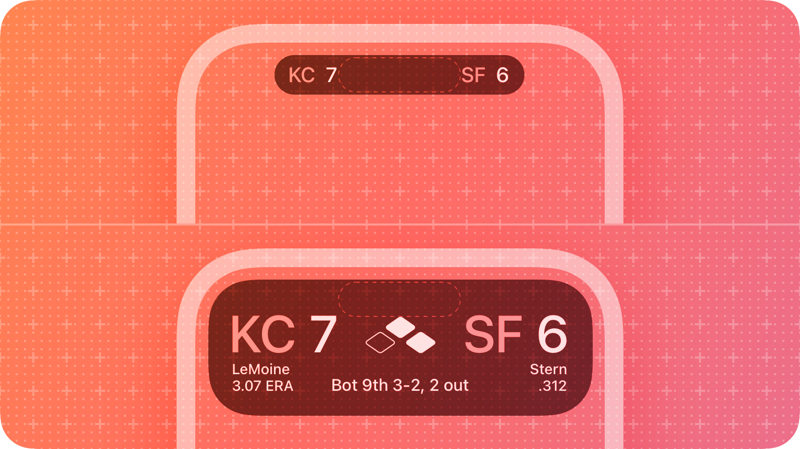
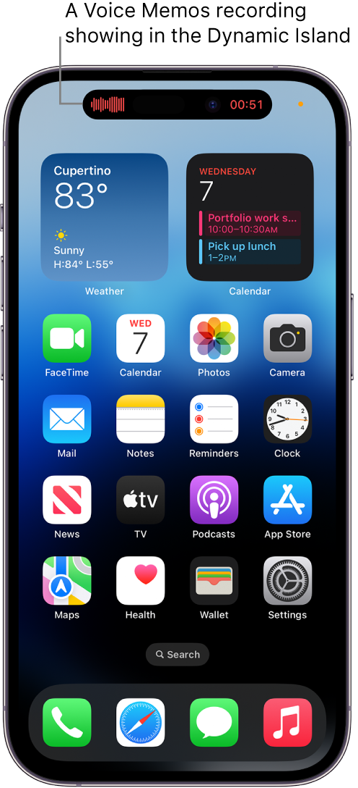
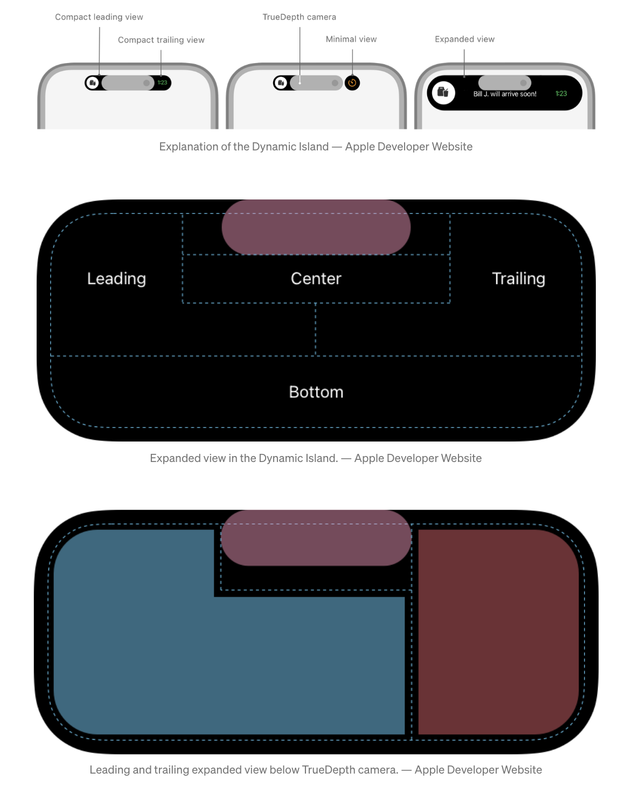
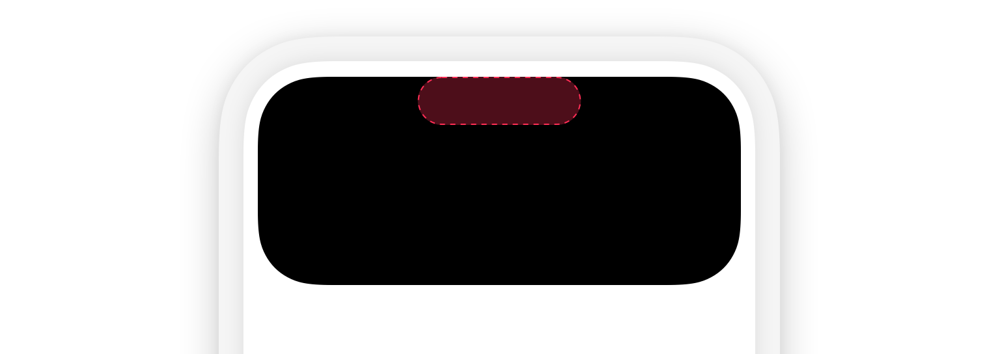

# Live Activities

### Live Activities
Live Activities hiển thị các thông tin mới nhất từ app của bạn, nó cho phép người dùng xem tình trạng hiện tại của các sự kiện hoặc tác vụ một cách nhanh chóng.  


### What is Dynamic Island?
>On iPhone 14 Pro and iPhone 14 Pro Max, you can check alerts and current activity in progress—such as music >that’s playing, your timer, an AirDrop connection, and directions from Maps—in the Dynamic Island on the Home >Screen or in any app. The Dynamic Island appears whenever your iPhone is unlocked.
>— Apple Support



### Design
https://developer.apple.com/design/human-interface-guidelines/components/system-experiences/live-activities/

Khi hiển thị Live Activity của bạn bên trong Dynamic Island, nó sẽ có 1 trong 3 trạng thái sau:

##### Compact
Hiển thị khi có một Live Activity đang được active.


##### Minimal
Hiển thị khi có nhiều Live Activities đang active.


##### Expanded
Khi người dùng nhấn giữ một Live Activity trong trạng thái `compact` hoặc `minimal`, hệ thống sẽ hiển thị thông tin nội dung ở trạng thái `expanded`


### Develop guidelines
##### Steps
1. Tạo một project với Widget Extension. 
2. Yêu cầu version iOS tối thiểu là 16.1:
- Thiết định target version là iOS 16.1 cho toàn bộ project
- Sử dụng `if #available` để sử dụng các đoạn code cho iOS 16.1 và cao hơn.
3. Trong ActivityConfiguration, sử dụng live activities view (banner) để hỗ trợ các thiết bị không support Dynamic Island
4. Tuỳ vào các trạng thái hiển thị của Dynamic Island bên trên, cần tạo các hiển thị khác nhau bên trong dynamicIsland dựa vào hành vi của người dùng:
  ```
  DynamicIslandExpandedRegion(.leading),
  DynamicIslandExpandedRegion(.trailing),
  DynamicIslandExpandedRegion(.center), and
  DynamicIslandExpandedRegion(.bottom)
  ```
5. Ngoài ra, trạng thái `compact` và `minimal` sẽ hoạt động khi người dùng chỉ cần xem mà không cần tương tác:
  ```
  compactLeading,
  compactTrailing,
  minimal
  ```
