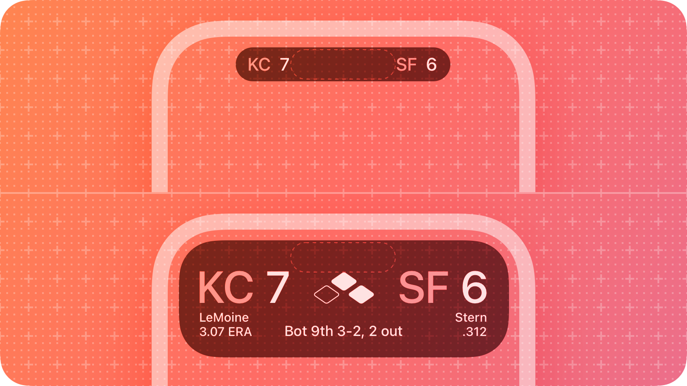
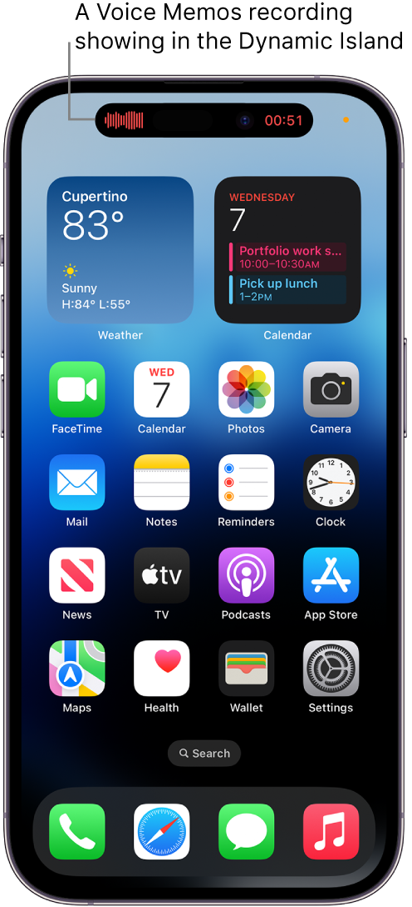
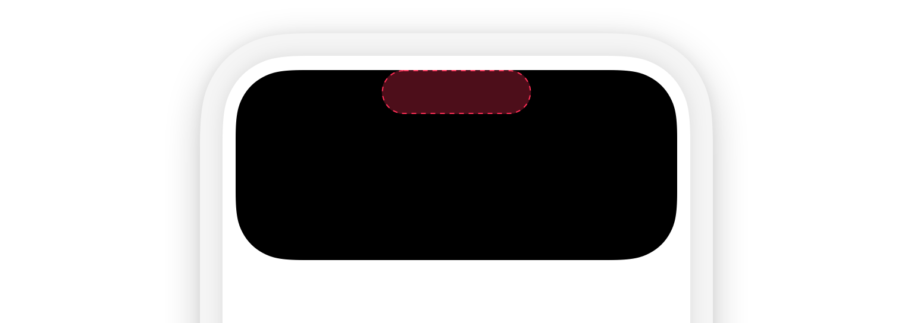

# Live Activities

### Live Activities
A Live Activity displays up-to-date information from your app, allowing people to view the progress of events or tasks at a glance.


### What is Dynamic Island?
>On iPhone 14 Pro and iPhone 14 Pro Max, you can check alerts and current activity in progress—such as music >that’s playing, your timer, an AirDrop connection, and directions from Maps—in the Dynamic Island on the Home >Screen or in any app. The Dynamic Island appears whenever your iPhone is unlocked.
>— Apple Support



### Design
https://developer.apple.com/design/human-interface-guidelines/components/system-experiences/live-activities/

When displaying your Live Activity in the Dynamic Island, the system uses one of the following three presentations:

##### Compact
The system uses the compact presentation when there’s only one Live Activity that’s currently active. The compact presentation is composed of two separate presentations: one that displays on the leading side of the TrueDepth camera, and one that displays on the trailing side. Although the leading and trailing presentations are separate views, they form a cohesive view in the Dynamic Island, representing a single piece of information from your app. People can tap a compact Live Activity to open the app and get more details about the event or task.


##### Minimal
When multiple Live Activities are active, the system uses the circular minimal presentation to display two of them in the Dynamic Island. The system chooses one Live Activity to appear attached to the Dynamic Island while the other appears detached. As with a compact Live Activity, people can tap a minimal Live Activity to open the app and get more details about the event or task.
An illustration that shows the minimal view in the Dynamic Island.


##### Expanded
When people touch and hold a Live Activity in a compact or minimal presentation, the system displays the content in an expanded presentation.


### Develop guidelines
##### Steps
1. We need to create a project with Widget Extension. You may refer to the previous tutorial.
2. The minimum OS version is 16.1, you may:
- Set target to iOS 16.1 for the whole project
- Use if #available to include code with 16.1 or above
3. In ActivityConfiguration, we use the live activities view (banner) to support devices that don’t support Dynamic Island.
4. Refer to the modes mentioned above, you can create different looks inside dynamicIsland base on user behaviors, e.g., when the users tap the island, the info will popup:
```
DynamicIslandExpandedRegion(.leading), DynamicIslandExpandedRegion(.trailing),
DynamicIslandExpandedRegion(.center), and
DynamicIslandExpandedRegion(.bottom)
```
5. Also, compact mode and minimal will work when users just need to view the live data on top without interacting:
```
compactLeading,
compactTrailing,
minimal
```

